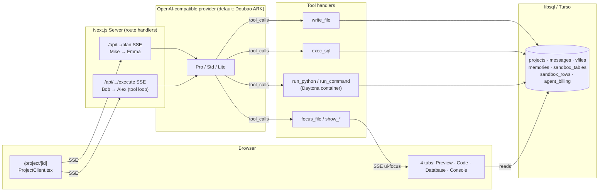

# openAtoms

> Open-source, self-hostable multi-agent **vibe-coding** platform — an open alternative to [Atoms.dev](https://atoms.dev).

Describe an app in one line. A small team of AI agents — a lead, a PM, a researcher, an architect, and an engineer — plans it, researches it, writes the code file by file, runs it in a **real cloud sandbox**, and drives your screen while they work. Real tool calls, real containers, everything persisted. No fake chat.

[](LICENSE)
[](https://nextjs.org)
[](#contributing)

- 🌐 **Live demo:** https://atoms-demo-sigma.vercel.app
- 📐 **Docs:** [Architecture](docs/ARCHITECTURE.md) · [Modules](docs/MODULES.md) · [Delivery spec](docs/DELIVERY-SPEC.md)

---

## Why openAtoms

Atoms.dev showed a compelling idea: agents that don't just chat — they **take the wheel**. They write files, run SQL, execute code in a container, and switch your tabs to show you what they just did.

openAtoms is an open, self-hostable take on that idea you can **read, fork, and run on your own keys**. There's no black box: every agent prompt, every tool, and the whole standard-operating-procedure (SOP) lives in `src/lib/agents`. Bring your own LLM key and your own sandbox, and you own the entire loop.

## Meet the team

| Agent | Role | What they do |
|---|---|---|
| **Mike** 🧭 | Team Lead | Routes the work and pauses for your approval at key checkpoints. |
| **Emma** 📝 | Product Manager | Turns your one-liner into a crisp JSON PRD and task list. |
| **Iris** 🔭 | Researcher | Validates the idea with web research before building. |
| **Bob** 🧱 | Architect | Picks the stack and designs + seeds the data model (`exec_sql`, `run_python`). |
| **Alex** ⚡ | Engineer | Writes the app file by file (`write_file`), then shows a live preview. |

Baton-passing is an explicit SOP, with a human **Approve** gate between planning and execution.

## How it works

- **Two SSE endpoints.** `/plan` streams Mike → Emma (routing + PRD). After you approve, `/execute` runs the tool-call loop (Bob → Alex, up to 8 steps) — both stream token-by-token.
- **Real sandbox.** [Daytona](https://daytona.io) cloud containers run `run_command` / `run_python` (no mock, no fallback — set `DAYTONA_API_KEY`). A virtual filesystem (`vfiles`) and a virtual SQL database (`sandbox_tables` / `sandbox_rows`) live in libsql; **Sandpack** renders the generated app as a working iframe you can click.
- **Hybrid tools.** Side-effect tools (`write_file` / `exec_sql` / `run_python`) plus presentation tools (`focus_file` / `show_table` / `show_preview` / `show_console`) let the agent **direct your attention** — Atoms-style "agent in the driver's seat".
- **Context + memory.** Three-layer context sharing (workspace / plan / per-agent) and short-term memory: Emma's `preferences` are distilled into `memories` and injected into Bob's and Alex's prompts, so the theme color you asked for actually reaches the generated CSS.

### Architecture



## Features

- **5-agent SOP pipeline** with a human approval checkpoint between plan and build.
- **Real code execution** in Daytona cloud containers — not a mock.
- **File + SQL sandbox** persisted in libsql / Turso, with a mini SQL parser for `exec_sql`.
- **Live preview** via Sandpack, pinned to `template="static"` so the iframe renders without the codesandbox.io bundler.
- **4 tabs** — Preview / Code (Monaco, read-only) / Database (sql.js DataGrid) / Console — with hybrid auto-switching driven by the agent's presentation tools.
- **Token accounting** with a per-agent billing sidebar.
- **Streaming everywhere** (Vercel AI SDK `streamText` + tool loop) with a **Stop** button wired to `AbortController` end-to-end.
- **Follow-ups, @-mentions, and an experimental Race Mode** (multiple engineers compete) — routed under `src/app/api/projects/[id]/{followup,mention,race}`.

## Tech stack

- **Next.js 16** App Router with route handlers for SSE.
- **React 19** client components for the streaming chat + Sandpack viewer.
- **Tailwind v4** zero-config theme.
- **OpenAI-compatible LLM** via `@ai-sdk/openai-compatible` — the default wiring targets **Doubao ARK** (Pro / Std / Lite). See [Using another LLM](#using-another-llm).
- **libsql / Turso** — single client, switches between a local file and Turso via env.
- **Daytona** — real Linux containers for `run_command` / `run_python`.
- **Sandpack** (`@codesandbox/sandpack-react`) + **sql.js** — in-browser preview and SQLite DataGrid.
- **Vercel AI SDK** — `streamText` + `maxSteps` powers the tool-call loop.

## Quick start

```bash
git clone git@github.com:Heliner/openAtoms.git
cd openAtoms
cp .env.example .env.local   # set DOUBAO_API_KEY and DAYTONA_API_KEY
pnpm install
pnpm dev
# open http://localhost:3000
```

Without `TURSO_URL` set, the app falls back to a local `./atoms-demo.db` SQLite file — the schema is applied on first request.

### Take it for a spin

1. Open `/` and click **Start →**.
2. Pick a template (e.g. *"A travel diary that remembers your trips"*) or type your own one-liner.
3. Mike posts a one-line plan and routes to Emma, who streams a JSON PRD with a `preferences` block. Click **Approve**.
4. Watch Bob call `exec_sql` to create and seed tables, then `run_python` to summarise; Alex calls `write_file` for `index.html` / `style.css` / `app.js`, ending with `show_preview`.
5. The **Preview** iframe is interactive. Switch to **Code**, **Database** (live rows), and **Console** (tool log). Hit **Stop** mid-stream to see the `AbortController` unwind cleanly.

## Configuration

| Env var | Required | Purpose |
|---|---|---|
| `DOUBAO_API_KEY` | ✅ | LLM calls (OpenAI-compatible; Doubao ARK by default). |
| `DAYTONA_API_KEY` | ✅ for `run_command` / `run_python` | Real container execution. No mock fallback. |
| `TURSO_URL` / `TURSO_TOKEN` | optional | Production persistence. Blank → local SQLite file. |
| `DOUBAO_MODEL_PRO/STD/LITE` | optional | Override the model/endpoint IDs. |
| `DAYTONA_API_URL` | optional | Defaults to `https://app.daytona.io/api`. |

### Using another LLM

The provider is created with `createOpenAICompatible` in [`src/lib/llm/doubao.ts`](src/lib/llm/doubao.ts). To point openAtoms at any other OpenAI-compatible endpoint (OpenAI, Groq, OpenRouter, a local vLLM, …), change `BASE_URL` and the API key there, and set the three model IDs via `DOUBAO_MODEL_*`. Everything downstream (streaming, tool loop, billing) is provider-agnostic.

## Self-hosting (Vercel + Turso + Daytona)

```bash
turso db create openatoms-prod
turso db tokens create openatoms-prod    # → TURSO_TOKEN
turso db show openatoms-prod --url        # → TURSO_URL

vercel link
vercel env add DOUBAO_API_KEY
vercel env add DAYTONA_API_KEY
vercel env add TURSO_URL
vercel env add TURSO_TOKEN
vercel deploy --prod
```

The schema is created lazily on the first request via `ensureSchema()`.

## Roadmap

openAtoms is intentionally lean today. Contributions toward any of these are welcome:

- **Supervisor LLM router** — dynamic dispatch instead of the hardcoded SOP.
- **Multi-file Next.js generation** — Alex currently emits static HTML/CSS/JS.
- **Visual editor** — DOM editing inside the preview iframe (cross-origin postMessage).
- **Real auth + project ownership** — GitHub OAuth (ownership is implicit today).
- **Vector / cross-project memory** — memory is project-scoped prompt injection today.
- **Payments** — the billing widget shows token cost only, no Stripe.
- **Race Mode GA** — the route is wired but experimental.

## Contributing

PRs and issues welcome. The interesting bits:

- **Agents & SOP** — [`src/lib/agents`](src/lib/agents) (`roles.ts`, `prompts.ts`, `tools.ts`, `orchestrate.ts`)
- **Sandbox** — [`src/lib/sandbox`](src/lib/sandbox) (`runner.ts` Daytona, `sqlbox.ts`, `vfiles.ts`)
- **LLM** — [`src/lib/llm`](src/lib/llm)

Run `pnpm lint` before opening a PR, and please open an issue to discuss anything large.

## Credits

Inspired by [Atoms.dev](https://atoms.dev). Built with the [Vercel AI SDK](https://sdk.vercel.ai), [Sandpack](https://sandpack.codesandbox.io), [Daytona](https://daytona.io), [Turso/libsql](https://turso.tech), and [Next.js](https://nextjs.org).

openAtoms began as a fast build (see [docs/SUBMISSION.md](docs/SUBMISSION.md) for the origin story) and is now maintained as an open-source project.

## License

[MIT](LICENSE) © Heliner and openAtoms contributors.
