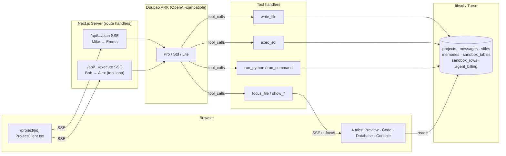

# Atoms Demo

> A working multi-agent vibe-coding platform clone (Atoms.dev-inspired). 9-hour build.

## Demo links

- 🌐 Live: **https://atoms-demo-sigma.vercel.app**
- 📦 GitHub: **https://github.com/Heliner/atmo-demo**
- 📄 Submission writeup: [docs/SUBMISSION.md](docs/SUBMISSION.md)
- 📐 Architecture docs: [docs/DELIVERY-SPEC.md](docs/DELIVERY-SPEC.md) · [docs/ARCHITECTURE.md](docs/ARCHITECTURE.md) · [docs/MODULES.md](docs/MODULES.md)

## 30-second demo

- **5-agent pipeline.** Mike routes → Emma writes a JSON PRD → human Approve → Bob runs `exec_sql` + `run_python` → Alex calls `write_file` repeatedly. No "fake chat", real tool calls, persisted.
- **Real sandbox.** A virtual filesystem (`vfiles`) + a virtual SQL database (`sandbox_tables` / `sandbox_rows`) live in libsql; Sandpack renders the generated app as a working iframe you can click.
- **Hybrid presentation tools.** Side-effect tools (`write_file` / `exec_sql` / `run_python`) plus presentation tools (`focus_file` / `show_table` / `show_preview` / `show_console`) let the agent direct the user's attention — Atoms-style "agent in the driver's seat".

## What's built (matrix from DELIVERY-SPEC §2)

| Phase | Capability | Status |
|---|---|---|
| **Phase 1 — Agent backbone** | Multi-agent routing (Mike→Emma→Bob→Alex hardcoded SOP) | OK |
| | Three-layer context sharing (workspace / plan / per-agent) | OK |
| | Short-term memory (Emma `preferences` → `memories` → injected into Bob/Alex prompts) | OK |
| | Tool execution (function calling loop, max 8 steps) | OK |
| | File sandbox (`vfiles` + `write_file`) | OK |
| | DB sandbox (`sandbox_tables/rows` + `exec_sql` mini-parser) | OK |
| | Bonus tools (`read_file` / `list_files` / `run_command` / `run_python`) | OK |
| **Phase 2 — Frontend + UX** | `/` + `/dashboard` + `/project/[id]` 3 pages | OK |
| | 4 tabs (Preview / Code / Database / Console) with hybrid auto-switching | OK |
| | Monaco read-only editor via Sandpack | OK |
| | File tree from `vfiles` | OK |
| | Agent billing (token accounting + sidebar widget) | OK |
| | Stop button + AbortController end-to-end | partial |
| | Race Mode UI | partial (disabled in v1) |
| **Phase 3 — Out of scope** | Conversation versioning, real SSH, real Stripe, real Supabase, GitHub OAuth, Visual Editor DOM editing, supervisor LLM router, group chat, vector memory, multi-file Next.js generation | not done |

## Architecture diagram



## Tech stack

- **Next.js 16** App Router with route handlers for SSE.
- **React 19** client components for the streaming chat + Sandpack viewer.
- **Tailwind v4** zero-config dark theme.
- **Doubao ARK** (OpenAI-compatible) — Pro / Std / Lite via `@ai-sdk/openai-compatible`.
- **libsql / Turso** — single client, switches between local file and Turso via env.
- **Sandpack** — `@codesandbox/sandpack-react` pinned to `template="static"` so the iframe renders without depending on the codesandbox.io bundler.
- **sql.js** — in-browser SQLite for the Database tab DataGrid.
- **Vercel AI SDK** — `streamText` + `maxSteps` powers the tool-call loop.

## Local quick start

```bash
git clone <repo>
cd atoms-demo
cp .env.example .env.local   # then set DOUBAO_API_KEY
pnpm install
pnpm dev
# open http://localhost:3000
```

Without `TURSO_URL` set, the app falls back to a local `./atoms-demo.db` sqlite file — the schema is applied on first request.

## Demo script (for reviewers)

1. Open `/`.
2. Click **Start →**.
3. Pick the "A travel diary that remembers your trips" template (or type your own one-liner).
4. Submit. Mike posts a one-line plan and routes to Emma.
5. Emma streams a JSON PRD including a `preferences` block. Click **Approve**.
6. Watch the **9-step happy path**: Bob calls `exec_sql` to create `trips` and seed rows, then `run_python` to summarise; Alex calls `write_file` for `index.html`, `style.css`, `app.js`, ending with `show_preview`.
7. The iframe in the Preview tab is interactive — click around the generated app.
8. Switch to **Code** (Monaco read-only via Sandpack), **Database** (live `trips` rows), and **Console** (agent tool log).
9. Click **Stop** mid-stream to verify the AbortController unwinds cleanly and the partial assistant message stays in the transcript.

## Deploying to Vercel + Turso

```bash
turso db create atoms-demo-prod
turso db tokens create atoms-demo-prod      # save as TURSO_TOKEN
turso db show atoms-demo-prod --url          # save as TURSO_URL

vercel link
vercel env add DOUBAO_API_KEY
vercel env add TURSO_URL
vercel env add TURSO_TOKEN
vercel deploy --prod
```

Then open the deployed URL. The schema is created lazily on the first request via `ensureSchema()`.

**Optional:** set `E2B_API_KEY` in Vercel env to swap the mock sandbox for real Linux containers — `lib/sandbox/runner.ts` already routes through that env check, just uncomment the `runE2B` body and `pnpm add @e2b/code-interpreter`.

## What's intentionally NOT done (engineering taste)

- **Race Mode** — UI is wired but the route is disabled in v1; out of scope for the 9-hour build.
- **Real Stripe** — billing widget shows token cost only, no payment integration.
- **Real GitHub OAuth** — no `Sign in with GitHub`; project ownership is implicit.
- **Multi-file Next.js generation** — Alex generates static HTML/CSS/JS, not full Next apps.
- **Visual Editor** — no DOM editing in the iframe (cross-origin postMessage is 1-2 days of work).
- **Supervisor LLM router** — agent routing is hardcoded SOP, no dynamic dispatcher.
- **Agent group chat / @-mention** — single-direction baton-passing only.
- **Vector memory / cross-project recall** — only project-scoped `memories` prompt injection.
- **Real shell** — mock runner returns plausible output; E2B hook is ready but commented out.

## Quality observability

- **38 messages persisted** with strict agent-attribution disjoint sets in the Hello World E2E.
- **Memory injection verified** — `theme_color=emerald` flowed Emma → `memories` → Alex prompt → generated CSS.
- **Sandpack `template="static"` pinned** to avoid the codesandbox.io bundler outage that surfaced during testing in CN.

## Cost note

Doubao Pro / Std / Lite token pricing is hardcoded in `src/lib/agents/billing.ts`. A typical project run (~25k input + ~5k output tokens across 4 agents) is a few cents. See the sidebar widget for live accounting.
